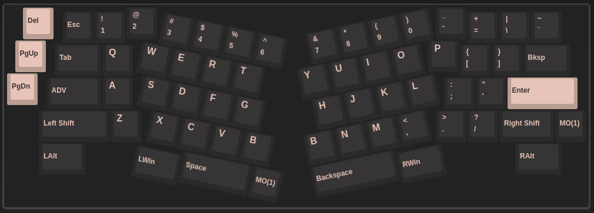
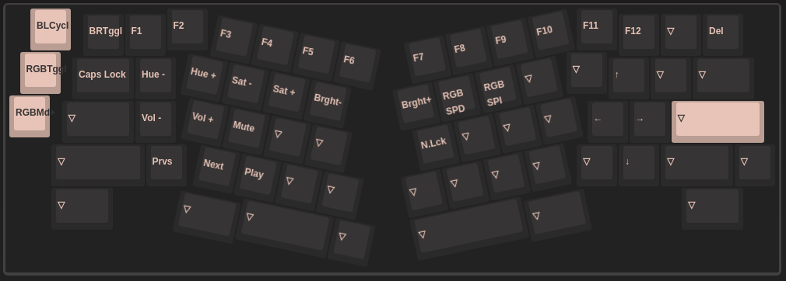

# OSA V2 (Alice)

Programmed with VIA.

Changes from default layout:

```
Left spacebar = Space
Right spacebar = Backspace
Middle spacebar = MOD(1)
MOD(1) + Tab = Caps lock toggle
MOD(1) + Q - I = LED Controls
MOD(1) + Z = Previous track
MOD(1) + X = Next track
MOD(1) + C = Play/Pause
MOD(1) + A = Volume down
MOD(1) + S = Volume up
MOD(1) + D = Mute toggle

Left ctrl = Esc on tap, ctrl on hold
```

Layout:



