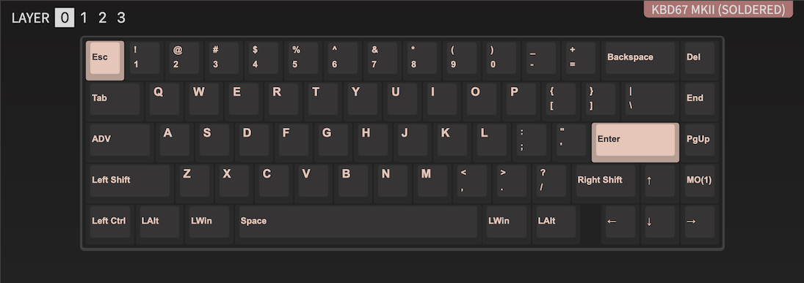
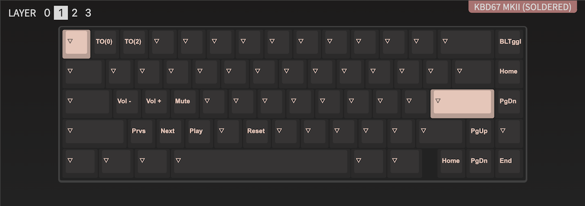
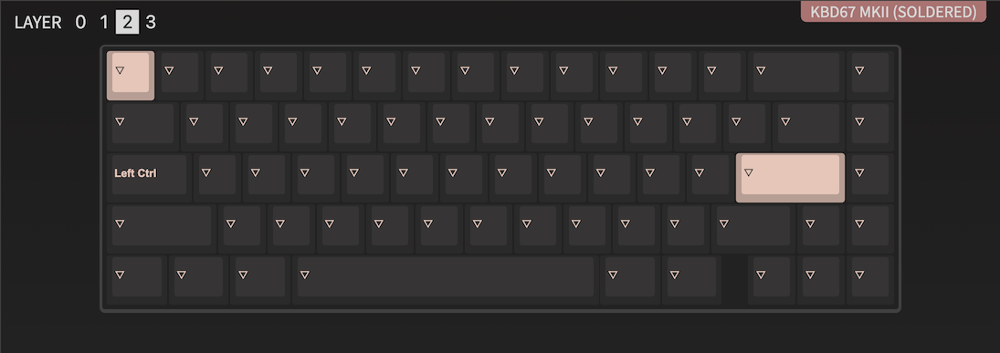

# KBD67 V2 MKII

PCB: kbdfans/kbd67/mkii_soldered

### Changelog

#### 2022-01-28

Flashed pcb with via support.

Fn+1: Turns on layer 0  
Fn+2: Turns on layer 2

#### 2022-02-21

~~Fn+1: Turns on layer 0~~  
Fn+[: Turns on layer 0  
~~Fn+2: Turns on layer 2~~  
Fn+]: Turns on layer 2

Fn+(1 to =): is now F1 to F12

The right side macro buttons are now: del, page up, page down.
