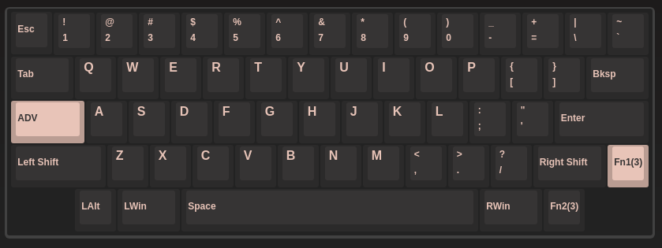
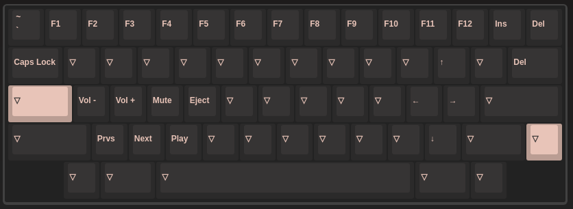

# RAMA KARA

Programmed with VIA.

Changes from default layout:

```
MOD(1) + Z = Previous track
MOD(1) + X = Next track
MOD(1) + C = Play/Pause

Left ctrl = Esc on tap, ctrl on hold
```

Layout:



